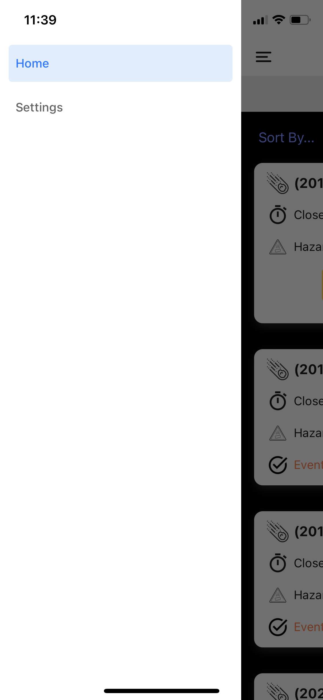
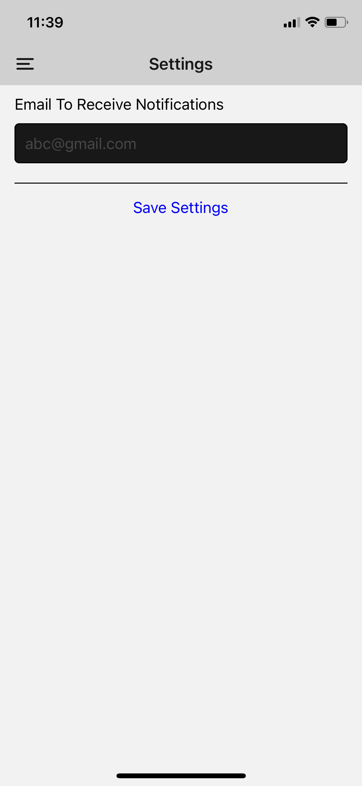
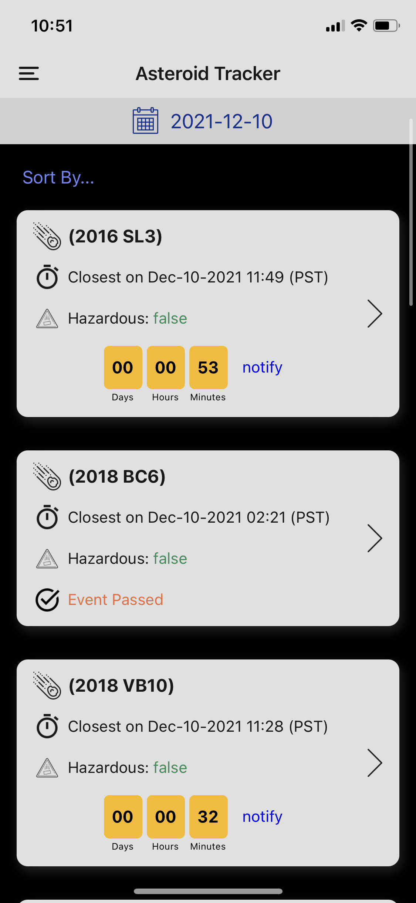
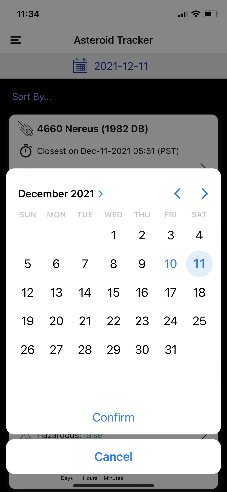
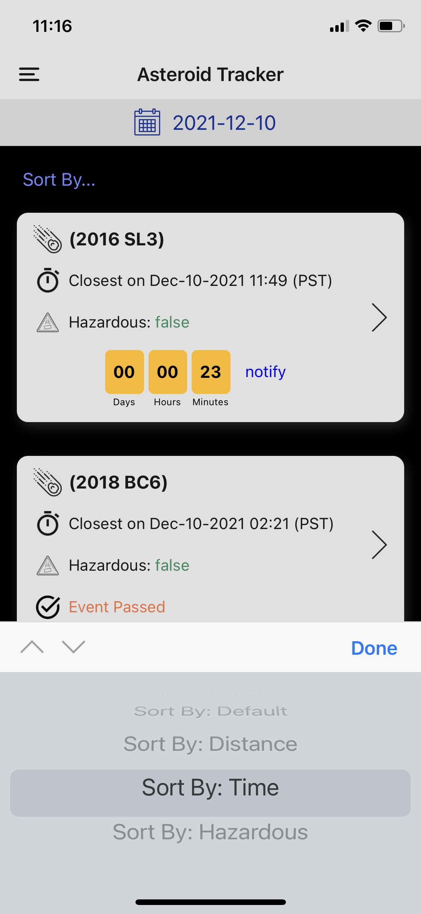
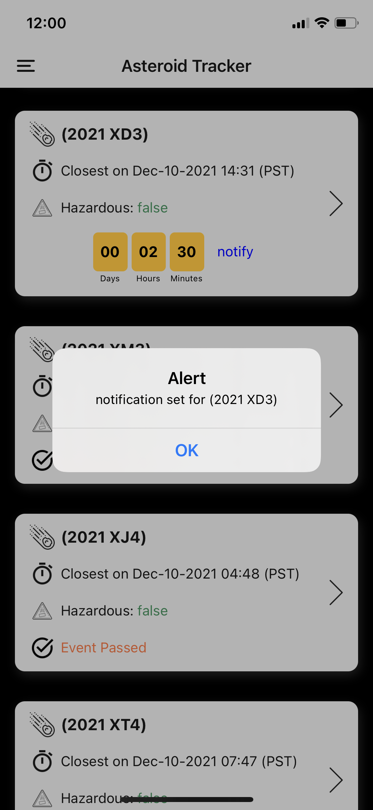
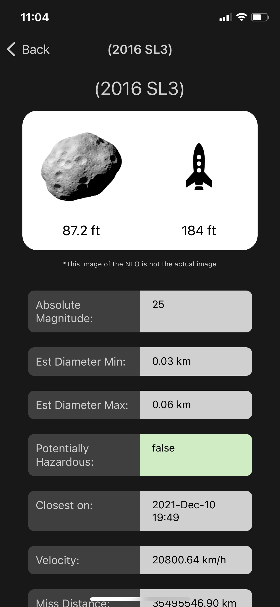

# Asteroid-Tracker-Notifier

<h3>Introduction:</h3>
According to United Nations Office for Outer Space Affairs (unoosa.org/ ), “Near-Earth Objects, or NEOs, represent
potentially catastrophic threats to our planet. A near-Earth object is an asteroid or comet which passes close to
the Earth’s orbit.” Researchers in astronomy and space objects observers have to study and research on near earth
objects (NEOs) which are approaching earth. Therefore, it is hard for them to constantly go through the raw data
on the website which NASA’s NEOWs (Near Earth Object Web Service) API is providing. In order to solve this
problem, I will be developing a mobile application using NASA’s NEOWs API [API Link] where user can view NEOs
closest approach date, speed and diameter and allow them to set a email notification by closest approach time which
will help astronomy community and it’s fan to get this data in a easy way.

<h3>Approach:</h3>
I have solved this problem by creating a mobile application which can work on both platforms i.e. iOS and Android.
I have used the following software architecture:  
<ul>
  <li>React Native</li>
  <li>Node.js</li>
  <li>Javascript</li>
  <li>Firebase</li>
  <li>Expo</li>
</ul>

<h3>Implementation:</h3>
Asteroid Tracker application allows user to see all the Near Earth Objects (NEO) including thier details like Absolute magnitude, maximum estimated diameter, minimum estimated diameter, hazardous-ness, closest approach date, speed, miss distance from Earth, the orbiting body, name and set an event timer notification .

<h3>iOS</h3>

  
  
  
  
  
  
  

<h3>Android</h3>

  
  
  
  
  
  
  

<h3>How to Download</h3>
https://expo.dev/@tejas27dhanani/AsteroidTracker

<h3>Conclusion:</h3>
The final product is allowing the users to view all the NEOs name, closest approach date, speed, diameter and set a
email reminder for closest approach time.

<h3>Citations:</h3>
• https://www.android.com/intl/en_ca/  
• https://www.apple.com/ca/ios/ios-15/ 
• https://www.unoosa.org/oosa/en/ourwork/topics/neos/index.html 
• https://api.nasa.gov/ 
• https://api.nasa.gov/neo/rest/v1/feed?start_date=2015-09-07&end_date=2015-09-08&api_key=DEMO_KEY 
• https://theskylive.com/near-earth-objects 
• https://reactnative.dev/ 
• https://nodejs.org/en/ 
• https://www.javascript.com/ 
• https://firebase.google.com/ 
• https://expo.dev/ 
• https://developer.mozilla.org/en-US/docs/Web/API/fetch 
• https://www.microsoft.com/en-ca/windows 
• https://github.com/wix/react-native-navigation 
• https://react-native-async-storage.github.io 
• https://www.hihonor.com/global/emui/
• https://www.pngaaa.com/detail/849234
